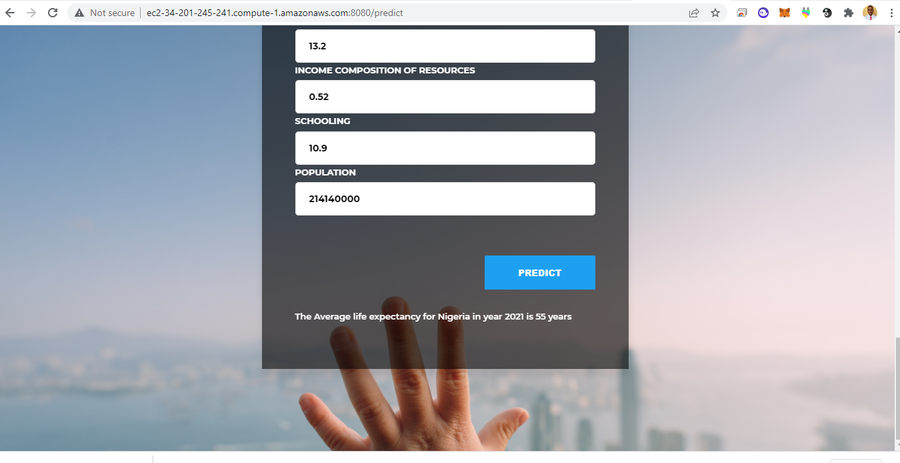

## ML Model Deployment with Flask and AWS EC2 Instance
This is a demo project to better understand and build proficiency how machine learning models can be deployed on production using Flask API and AWS EC2 Instance

### Introduction/Objectives

<strong>Life Expectancy.</strong>

Life expectancy refers to the number of years a person is expected to live based on the statistical average. Life expectancy varies by geographical area and by era. In the Bronze age, for example, life expectancy was 26 years, while in 2010, it was 67 years. 

The life expectancy for a particular person or population group depends on several variables such as their lifestyle, access to healthcare, diet, economical status and the relevant mortality and morbidity data.

However, as life expectancy is calculated based on averages, a person may live for many years more or less than expected. 

### Methodologies
1.	Data Cleaning.
2.	Exploratory data analysis
3.	Feature Engineering
4.	Machine Learning Pipeline with Algorithm
5.  Choosing the best ML Algorithm
6.  Pickle and dumping the model in the model folder
5.	Conclusion and visualization with Dash

### Environment, Tools and Libraries:
1.	Pandas for data manipulation 
2.	Numpy for mathematical calculation and analysis 
3.	Seaborn and Matplotlib for visualization and insights
4.	Python 3.9 Environment 
5.	Jupyter and Microsoft Excel as tools  
6. Sklearn for Machine Learning and preprocessing  

### Project Structure
This project has six major parts :
1.  Data - This folder contains the training data used for building the Machine learning model
2.  model - This folder contains the pickle file for our Machine Learning model to predict life expectancy of a country based on training data in Data folder.
3. app.py - This contains Flask APIs that receives employee details through GUI or API calls, computes the precited value based on our model and returns it.
4. request.py - This uses requests module to call APIs already defined in app.py and dispalys the returned value.
5. static - This folder contains the CSS- styling sheets that is used to adjust content size, spacing, color and/pr add decorative features such as animations
6. templates - This folder contains the HTML template to allow user to enter life expectancy features and displays the predicted average life expectancy.

